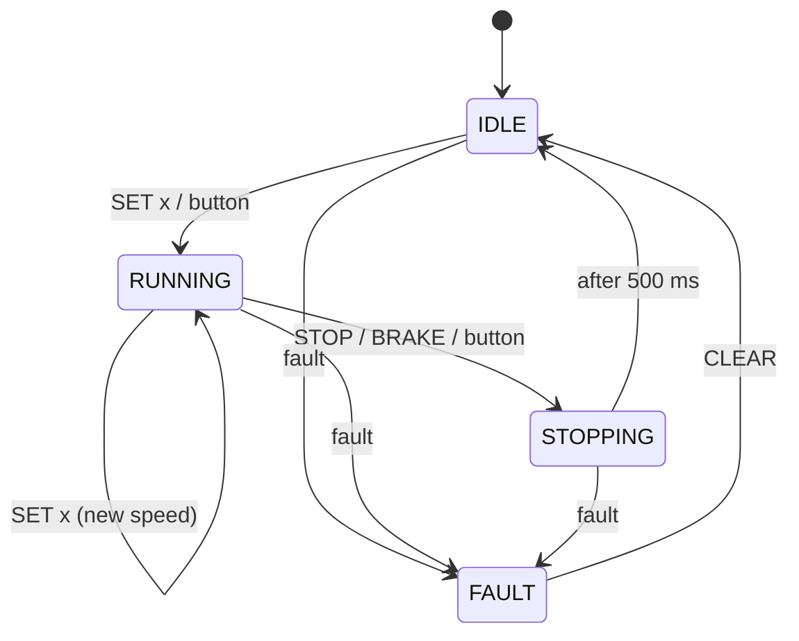

# STM32 DC Motor Controller

Bare-metal DC motor controller firmware for the STM32F303RE, using an L298N H-bridge.
The motor is driven with a 20 kHz hardware PWM and can be controlled with the on-board button or with text commands from a serial terminal.
The state of the motor is shown on an SSD1306 OLED.

I built this project to learn how DC motors work and how to structure embedded firmware.

## Features

- Speed control with 20 kHz PWM (0–100 %)
- Direction control through the L298N: forward, reverse, brake, stop
- Start / stop with the on-board button
- Serial command interface (`SET`, `DIR`, `STOP`, `STATUS` ...)
- State machine: `IDLE`, `RUNNING`, `STOPPING`, `FAULT`
- OLED status screen

## Systems used and why (for some)

| Technique | Why I used it |
|---|---|
| Hardware PWM with TIM1 (PSC 0, ARR 3599 → 20 kHz) | The timer generates the PWM on its own, so it keeps running while the CPU does other work. |
| Reading ARR at run time for the duty calculation | If the PWM frequency is changed in CubeMX, the duty code still works without changes. |
| H-bridge control with IN1 / IN2 + PWM on ENA | IN1/IN2 select which switches of the bridge are on (direction), ENA sets the speed. |
| Active brake (IN1 = IN2 = 1, ENA = 1) | Shorting the motor terminals stops it much faster than letting it coast. |
| State machine | All rules about what is allowed in which situation are in one place. `FAULT` is latched, so the motor never restarts by itself after an error. |
| UART receive with interrupts | Characters can arrive at any time. With an interrupt the CPU does not have to keep checking for them. |
| Non-blocking timing with `HAL_GetTick()` | `HAL_Delay()` would freeze the main loop, so the button and commands would not respond. |
| I2C at 400 kHz | Sending the full 1024-byte framebuffer to the OLED takes about 23 ms instead of about 92 ms at 100 kHz. |
| Layered code (`app/` and `bsp/`) | Only `bsp/` talks to the hardware. If a pin or a driver changes, the application code stays the same. CubeMX can also regenerate its code without touching mine. |

## Components

| Component | Role |
|---|---|
| STM32F303RE | Main controller |
| L298N dual H-bridge module | Drives the motor |
| Yellow "TT" gear motor, 3–6 V | The motor |
| 4 × AA battery pack (6 V) | Motor power |
| SSD1306 | Status display |

## Wiring

| Signal | STM32 pin | Nucleo header | Connected to |
|---|---|---|---|
| Motor speed (PWM) | PA8, TIM1_CH1 | D7 | L298N ENA (jumper removed) |
| Motor direction 1 | PA9, GPIO | D8 | L298N IN1 |
| Motor direction 2 | PA10, GPIO | D2 | L298N IN2 |
| OLED SCL | PB8, I2C1_SCL | D15 | OLED SCK/SCL |
| OLED SDA | PB9, I2C1_SDA | D14 | OLED SDA |
| UART TX / RX | PA2 / PA3, USART2 | – | ST-LINK virtual COM port |
| Start / stop button | PC13 | on-board B1 | active-low |
| Heartbeat LED | PA5 | on-board LD2 | toggles every 500 ms |

### Power

| From | To |
|---|---|
| Battery + | L298N 12V terminal |
| Battery − | L298N GND terminal |
| Nucleo GND | L298N GND terminal (common ground is required) |
| Nucleo 5V | L298N 5V terminal |

With a 6 V battery the L298N's on-board 5 V regulator does not have enough headroom, so its 5V-EN
jumper is removed and the logic side is fed from the Nucleo's 5 V pin instead. With a 7–12 V supply
the jumper can be put back and the Nucleo 5 V wire removed.

## Architecture

```
DCMotorController/
├── app/      application: state machine, commands, OLED status
├── bsp/      board support: board.c (PWM, GPIO, UART, I2C, ADC), ssd1306.c (display)
├── config/   settings (version, timings)
├── Core/     CubeMX generated code, main.c only calls app_init() and app_loop()
└── Drivers/  STM32 HAL
```

## State machine



## Serial command interface

Connect to the ST-LINK virtual COM port at 115200 baud, line ending CR.

| Command | Action | Allowed in |
|---|---|---|
| `HELP` | List commands | any |
| `STATUS` | Print state, applied and requested direction/duty | any |
| `DIR FWD` / `DIR REV` | Select direction | `IDLE` only |
| `SET <0-100>` | Set duty in %. Starts the motor from `IDLE` | `IDLE`, `RUNNING` |
| `STOP` / `BRAKE` | Active brake, then `IDLE` | any |
| `FAULT` | Force the fault state (test) | any |
| `CLEAR` | Leave the fault state | `FAULT` only |

Example session:

```
> DIR REV
OK
> SET 70
State: RUNNING
OK
> DIR FWD
ERR direction can only change in IDLE
> SET abc
ERR value must be 0..100
> STOP
State: STOPPING
OK
State: IDLE
```

## Limitations and TODO

The speed is not measured, so the control is open-loop. The L298N also loses about 2 V, so with a
6 V battery the motor gets about 4 V at 100 % duty.

- [ ] Soft start (duty ramp)
- [ ] Button debounce
- [ ] E-STOP button on the TIM1 break input
- [ ] Watchdog and communication-loss timeout
- [ ] Battery voltage monitoring with the ADC
- [ ] UART ring buffer (fast input can lose characters)
- [ ] Speed sensor and PID speed control


## AI disclosure

This was a learning project, and I used an AI assistant (Claude) along the way. I used it to:

- explain concepts I was learning (timers, H-bridges, interrupts, state machines etc.)
- help me when I got stuck on a problem
- write repetitive code, such as the 5x7 font table
- help me write this README (Redesign/editing it after I've wrote it)

The hardware setup, majority of firmware structure and all testing on the real board were done by me.
